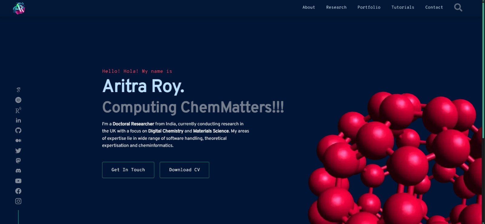

# Aritra Roy - Portfolio

[](https://astro.build) [](https://react.dev) [](https://www.typescriptlang.org/) [](https://threejs.org/) [](https://sass-lang.com/) [](https://www.php.net/) [](https://mdxjs.com/)

Personal portfolio website for Aritra Roy - Doctoral Researcher in Digital Chemistry and Materials Science at [SLIMES](https://slimeslab.github.io/) Lab in LSBU, UK under [Dr John Buckeridge](https://jbuckeridge.github.io/).



## Features

- **Animated Fullerene**: Floating molecular background on homepage
- **Research Showcase**: Publications, software projects, and collaborators (3D interactive globe for larger devices)
- **Blog & Tutorials**: Technical articles with syntax highlighting
- **Responsive Design**: Optimized for all devices
- **Performance**: Built with Astro for fast page loads

## Tech Stack

- **Framework**: Astro 5
- **UI**: React 18 + TypeScript
- **Styling**: SCSS
- **3D Visualization**: React Globe GL (collaborators map)
- **Content**: MDX with Expressive Code
- **Data**: Various API integration

## Getting Started

```bash
# Install dependencies
npm install

# Start dev server
npm run dev

# Build for production
npm run build

# Preview production build
npm run preview
```

## Data Generation

```bash
# Update publications from ORCID
npm run generate-publications

# Update collaborators data
npm run generate-collaborators

# Update both (runs before build)
npm run prebuild
```

## Project Structure

```
├── src/
│   ├── assets/          # Images, styles, data
│   ├── components/      # React & Astro components
│   ├── layouts/         # Page layouts
│   ├── pages/          # Routes
│   └── content/        # Blog posts & tutorials
├── public/             # Static assets
└── scripts/            # Data generation scripts
```

## Copyright

© 2025 Aritra Roy | All rights reserved.

---

Built with ❤️ using [Astro](https://astro.build).
