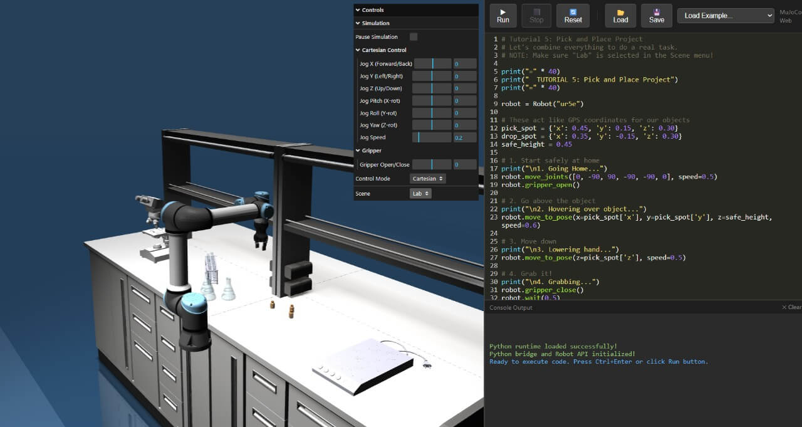
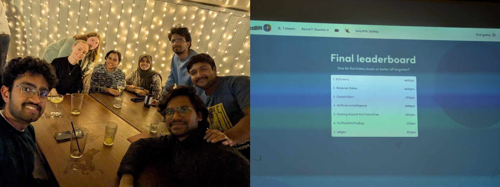
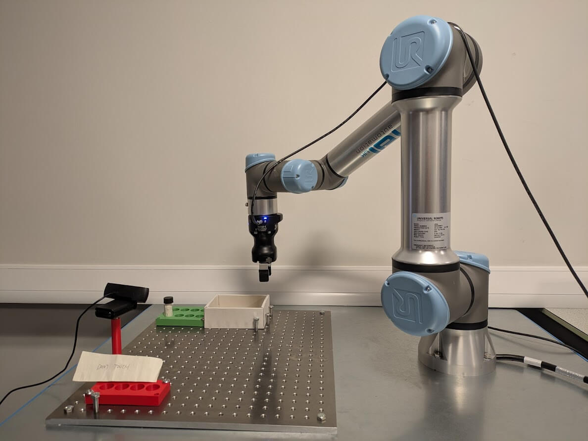
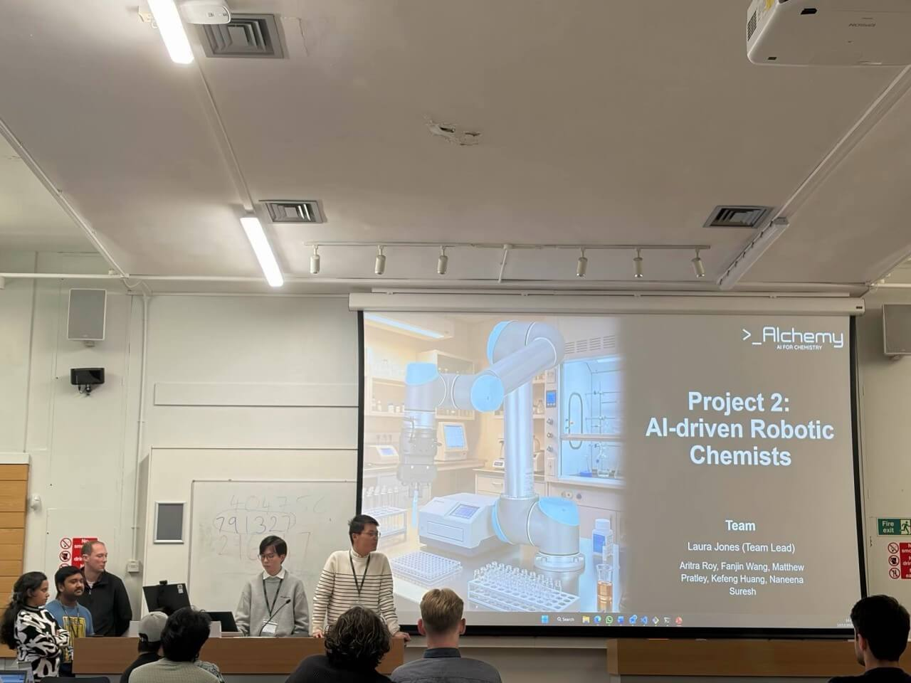
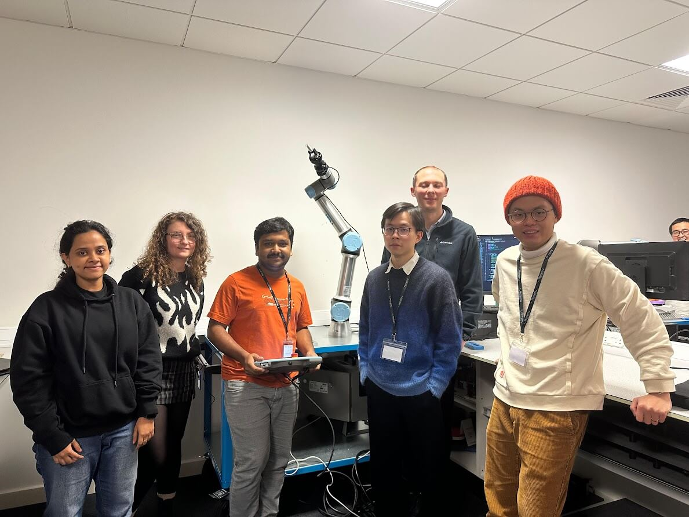

import ProjectPresentation from "./figures/project-presentation.jpg";
import RoboticSetup from "./figures/robotic-setup.jpg";
import TeamPhoto from "./figures/team-photo.jpg";
import ELFchemyAndLeaderboard from "./figures/team-elfchemy-and-leaderboard.jpg";
import SimulationInterface from "./figures/simulation-interface.jpg";
import FutureLabsSlide from "./figures/future-labs-slide.jpg";
import CombinedWorkflow from "./figures/combined-workflow.gif";

_Last week, I had the incredible opportunity to participate in the **Winter School: Robotics and AI for Materials Chemistry 2025**, organised by **[Alchemy](https://aichemy.ac.uk/)**. This intensive five-day programme brought together researchers, students, and professionals passionate about the intersection of robotics, artificial intelligence, and chemistry. What followed was an extraordinary journey of learning cutting-edge techniques, hands-on experimentation with robotic systems, and building meaningful connections with brilliant minds from across the field._

## Day 1: Setting the Foundation 🚀

The winter school kicked off with an excellent lineup of speakers who set the stage for what would be an intensive week of learning and building.

**[Felix Hanke](https://www.linkedin.com/in/felixhanke/)**, **[Manisha Dubey](https://www.linkedin.com/in/manisha-dubey-25596536/)**, and **[George Killick](https://www.linkedin.com/in/george-killick96/)** delivered inspiring talks that introduced us to the fundamentals of robotics and AI applications in materials chemistry. Their presentations covered everything from theoretical frameworks to practical implementations, giving us a solid foundation to build upon.

The excitement was palpable as we were introduced to our hands-on projects. I was assigned **Project 2: AI-driven Robotic Chemists**, where our goal was clear but ambitious: _design and implement an intuitive framework for teaching robotic chemists using demonstrations in a simple vial pick-and-place experimental workflow._

Our team composition was diverse and talented:

- • **[Laura Jones](https://www.linkedin.com/in/laura-jones-76b3a0a3/)** (Team Lead)
- • **[Aritra Roy](https://www.linkedin.com/in/aritraroy24/)** (myself with zero robotics experience! 😅)
- • **[Fanjin Wang](https://www.linkedin.com/in/fanjinwang/)**
- • **[Matthew Pratley](https://www.linkedin.com/in/mtpratley/)**
- • **[Kefeng Huang](https://www.linkedin.com/in/kefhuang/)**
- • **[Naneena Suresh](https://www.linkedin.com/in/naneena-suresh-56528821b/)**

⁕ ⁕ ⁕

## Day 2: Bayesian Optimisation and Social Bonding 🎯

Day 2 began with a fascinating talk by **[Bojana Ranković](https://www.linkedin.com/in/bojana-rankovi%C4%87/)** on **Bayesian Optimisation for Chemistry**. The session explored how Bayesian methods can be leveraged to optimize experimental parameters efficiently, a crucial technique for autonomous laboratories where minimising experimental trials is essential.

Following the theoretical session, we dived into a practical tutorial on **robotic simulation**. This hands-on experience gave us invaluable insights into planning and testing robotic movements in a virtual environment before deploying them on actual hardware - a critical skill for developing reliable autonomous systems.

  **Figure 1:** The robotic simulation environment we worked with during the
  tutorial

### A Memorable Evening at Frederiks Pub 🍺🏆

The evening took us to **Frederiks pub** for a wonderful social gathering that proved to be just as enriching as the technical sessions. Over drinks and dinner, we participated in a quiz competition that tested our knowledge across various topics.

Team Elfchemy emerged victorious! 🎉

However, full credit goes to our quiz wizards ([Sari Zerah](https://www.linkedin.com/in/sarizerah/), [Naneena Suresh](https://www.linkedin.com/in/naneena-suresh-56528821b/), and [Jasmine Robertson](https://www.linkedin.com/in/jasmine-robertson-182042214/)) who answered an astounding 99% of the questions correctly. Their brilliance carried the team to victory and made the evening unforgettable.

  **Figure 2:** Team ELFchemy and the final quiz leaderboard - Our team takes
  the crown with 4692 points!

⁕ ⁕ ⁕

## Day 3: Deep Dive into Imitation Learning 🤖

Day 3 brought us deeper into the world of autonomous laboratories with an insightful talk by **[Prof. Subramanian Ramamoorthy](https://www.linkedin.com/in/subramanian-ramamoorthy-9650595/)** on robotics and AI. His expertise provided the perfect foundation as we transitioned into intensive hands-on project work.

### The Story Behind Our Robot: Solving a Real Lab Problem 🔬

Every chemistry lab has _that_ annoying lab partner who leaves unwanted samples scattered everywhere. Our project was born from this universal frustration: **what if a robot could automatically identify these out-of-place samples and dispose of them properly?**

The vision was clear - an autonomous system that could:

- • Identify misplaced or unwanted samples
- • Pick them up from anywhere in the lab
- • Dispose of them in the appropriate waste bin

Simple in concept, but ambitious in execution!

### From Imitation Learning to Computer Vision: A Pivot Story 🔄

Our initial approach was to use **imitation learning** - teach the robot by showing it how to pick and place vials through human demonstrations. The beauty of this method is its flexibility: the robot learns the manipulation strategy and can generalise to different positions and orientations.

However, reality hit hard. With only a few hours and **just 16 demonstrations** collected (far fewer than the hundreds typically needed for robust imitation learning), our model couldn't reliably learn the pick-and-place task. The limited training data simply wasn't enough for the neural network to generalise well.

**Time for Plan B!** - Thanks to Fanjin's quick thinking🤗🫡

We pivoted to a **CNN-based vision system** - a more constrained but achievable solution within our timeframe:

**Our Implemented Solution:**

- • **Hardware**: UR5e collaborative robotic arm
- • **Vision System**: CNN-based classifier for vial tray hole detection
- • **Task**: Automated vial transfer from predefined storage positions to disposal bin
- • **Key Innovation**: Real-time computer vision pipeline that identifies hole numbers, enabling precise vision-guided positioning
- • **Limitation**: Works only with vials in the standardised holder setup
  The CNN classifier we developed could accurately identify hole numbers in the vial tray, enabling vision-guided positioning for precise vial pickup and placement. Whilst more limited than our original vision, this approach proved robust and reliable for our demonstration workflow.

**The Critical Missing Piece:**

In our current implementation, the robot blindly picks up _any_ vial it detects - there's no intelligence to distinguish between good samples (that should be kept) and bad samples (that should be discarded). This is obviously problematic in a real lab setting! Imagine the horror of watching your carefully prepared samples being tossed into the waste bin by an overzealous robot! 😱

  **Figure 3:** The UR5e robotic arm setup with the webcam during the project
  development

Collecting demonstration data and working through the intricacies of computer vision-guided robotic manipulation was both challenging and incredibly rewarding. Every successful vial transfer felt like a small victory towards building truly autonomous chemistry labs.

⁕ ⁕ ⁕

## Day 4: The Final Push ⚡

The penultimate day began with an excellent talk by **[Efi Psomopoulou](https://www.linkedin.com/in/efi-psomopoulou/)**, which provided valuable insights that energised us for the final sprint on our projects.

The rest of Day 4 was an intense race against time. We worked tirelessly to:

- • Refine our computer vision pipeline for better accuracy
- • Perfect the UR5e arm's movement trajectories
- • Test and debug the complete workflow
- • Prepare our presentation materials

There's something uniquely special about the final day of a workshop - the collaboration intensifies, debugging sessions turn into brainstorming marathons, and you witness months of abstract concepts materialise into working demonstrations.

  

  **Figure 4:** Our UR5e robotic arm in action - using CNN-based vision to
  identify vial positions, pick them from the tray, and transfer them to the
  disposal area.

### Future Directions: Completing the Vision 🔮

While we successfully implemented a CNN-based vision system for our demonstration, we have a clear roadmap to achieve our original ambitious goal:

**Phase 1: Intelligent Sample Classification** 🎯

- • **Critical Priority**: Implement sample quality assessment before disposal
- • Develop a classification system to distinguish between:

&nbsp;&nbsp;&nbsp;&nbsp;&nbsp;&nbsp;• Good samples (valuable materials that must be preserved)

&nbsp;&nbsp;&nbsp;&nbsp;&nbsp;&nbsp;• Bad/waste samples (safe to discard)

&nbsp;&nbsp;&nbsp;&nbsp;&nbsp;&nbsp;• Unknown samples (requires human verification)

- • This prevents the catastrophic scenario of discarding important samples!
- • Could use spectroscopy, barcode reading, or visual appearance classification

**Phase 2: Flexible Positioning via Imitation Learning** 🤖

- • Return to our original approach: **imitation learning** for pick-and-place
- • Collect a comprehensive demonstration dataset (100+ examples)
- • Enable the robot to:

&nbsp;&nbsp;&nbsp;&nbsp;&nbsp;&nbsp;• Pick up vials from _anywhere_ in the lab, not just predefined tray positions

&nbsp;&nbsp;&nbsp;&nbsp;&nbsp;&nbsp;• Handle various orientations and positions

&nbsp;&nbsp;&nbsp;&nbsp;&nbsp;&nbsp;• Adapt to different vial sizes and types

- • This eliminates the current limitation of requiring the standardised holder setup

**Phase 3: Complete Autonomous Lab Assistant** ⚡

- • Multi-step workflows: identify → classify → decide → execute → dispose
- • Integration with lab inventory management systems
- • Obstacle avoidance and safe human-robot collaboration
- • Adaptive grasping for different container types
- • Learning from mistakes and continuous improvement

**The End Goal:** A robot that can autonomously tidy up the lab by identifying misplaced samples, determining their value, and either returning them to proper storage or safely disposing of waste - all while never touching the good samples that took hours to prepare! 🎓

⁕ ⁕ ⁕

## Day 5: Presentations and Reflections 🎯

The final day opened with an inspiring talk by **[Shijing Sun](https://www.linkedin.com/in/shijing-sun-4205583a/)** on **"Human-in-the-Loop Autonomy in Energy Materials Science"** - a perfect blend of AI autonomy and human expertise that resonated deeply with all the work we'd been doing throughout the week.

**Figure 5:** Presentation of our project: AI-driven Robotic Chemists

### The Main Event: Project Showcases 🚀

Then came what everyone had been working toward: presentations of all **7 hands-on projects**! Each team showcased incredible work - from AI-driven robotic chemists to advanced materials discovery workflows. The diversity of approaches and creativity in problem-solving was truly impressive.

Our team presented our CNN-based vision system for guiding the UR5e robotic arm in automated vial handling. Despite the limited timeframe, we successfully demonstrated:

- • Real-time hole detection and classification
- • Vision-guided robotic positioning
- • Automated vial pick-and-place operations
- • A scalable framework for chemistry lab automation

The journey from concept to working demonstration in just a few days was intense, challenging, and incredibly rewarding! 💡

### Lessons Learned: When Plans Meet Reality 📚

Our project journey taught us valuable lessons about rapid prototyping and adaptive problem-solving:

**What We Learned:**

&nbsp;&nbsp;&nbsp;1. **Data Requirements Matter**: Imitation learning needs substantial demonstration data (100+ examples). Our 16 demonstrations were insufficient for reliable learning.

&nbsp;&nbsp;&nbsp;2. **Pivot Intelligently**: When faced with constraints, find a solution that's both achievable and scientifically sound. Our CNN approach was more limited but actually worked!

&nbsp;&nbsp;&nbsp;3. **Safety First**: We realised mid-development that our robot needed sample classification - imagine the disaster of throwing away good samples!

&nbsp;&nbsp;&nbsp;4. **Prototype, Then Scale**: Start with a constrained but working system (standardised holder), then expand capabilities (arbitrary positions) in future iterations.

&nbsp;&nbsp;&nbsp;5. **Time-boxing Works**: Sometimes having limited time forces creative solutions and prevents overthinking.

**The Honest Truth:**

Our final demonstration wasn't our original ambitious vision, but it was a _working_ system that demonstrated real principles of lab automation. In research, the ability to pivot, learn from constraints, and deliver a functional prototype is often more valuable than stubbornly pursuing a plan that isn't working.

And let's be real - even our simplified version would still be incredibly useful for that annoying lab partner problem! 😄

**Figure 6:** Team behind our AI-driven robotic chemists project

⁕ ⁕ ⁕

## Key Takeaways and Reflections 🎓

This winter school was an extraordinary experience that went far beyond technical learning:

### Technical Skills Gained:

- • **Bayesian Optimisation** for experimental design in chemistry
- • **Robotic Simulation** and planning techniques
- • **Computer Vision** for laboratory automation
- • **CNN-based Classification** for object detection and localisation
- • Working with **collaborative robotic arms** (UR5e)
- • **Human-in-the-loop** vs **AI-in-the-loop** autonomy concepts

### The Bigger Picture:

The workshop reinforced how robotics and AI are fundamentally transforming materials discovery and chemistry research. From Bayesian optimisation to robotic manipulation, we're building the toolkit for the self-driving laboratories of tomorrow.

The progression from traditional labs (fully human-supervised) to current semi-autonomous systems (expert-supervised ML) to the envisioned future (fully AI-in-the-loop agents) represents a paradigm shift in how we conduct scientific research. Our project, though focused on a simple pick-and-place task, demonstrated the foundational principles that will enable this transformation.

### Community and Collaboration:

Beyond the technical aspects, this week was about building connections with brilliant researchers, learning from expert practitioners, and experiencing the collaborative spirit that drives innovation in this field.

From pub quizzes to project presentations, from debugging sessions to coffee break discussions - every moment contributed to an unforgettable learning experience! 🏆✨

⁕ ⁕ ⁕

## Acknowledgments 🙏

Huge thanks to **Alchemy** (specially, [Caroline](https://www.liverpool.ac.uk/people/caroline-woods), [Gabriella](https://www.linkedin.com/in/gabriella-pizzuto-2847bb61/) & [Xenofon](https://www.linkedin.com/in/evangelopo/)) for organising this incredible winter school and providing us with the opportunity to work on cutting-edge robotics and AI for materials chemistry. And a huge shout-out to our team leader **Laura Jones** for her exceptional leadership and coordination throughout the project.

Special gratitude to all the speakers who shared their expertise:

- • Felix Hanke
- • Manisha Dubey
- • George Killick
- • Bojana Ranković
- • Prof. Subramanian Ramamoorthy
- • Efi Psomopoulou
- • Shijing Sun

And of course, to my amasing Team colleagues - working with you all was an absolute pleasure!

## Looking Forward 🔭

This winter school has reinforced my commitment to advancing computational materials science and autonomous laboratory systems. The skills, connections, and inspiration gained during this week will undoubtedly influence my research directions at the **SLIMES Research Group** (South London Innovative Materials Evaluation Squad) at **London South Bank University**.

The future of chemistry is autonomous, intelligent, and collaborative - and I'm excited to be part of building it! 🚀

⁕ ⁕ ⁕

Thank you for reading.

I hope you found this **_"Winter School: Robotics and AI for Materials Chemistry 2025"_** article insightful. Please share if you enjoyed it and leave a comment to let me know your thoughts on AI-driven laboratory automation!

You can connect with me on <i><b><a href="https://www.linkedin.com/in/aritraroy24/" target="_blank">LinkedIn</a></b></i>, <i><b><a href="https://www.instagram.com/royaritra24/" target="_blank">Instagram</a></b></i>, <i><b><a href="https://twitter.com/aritraroy24" target="_blank">Twitter</a></b></i> or <i><b><a href="https://github.com/aritraroy24" target="_blank">GitHub</a></b></i>.

